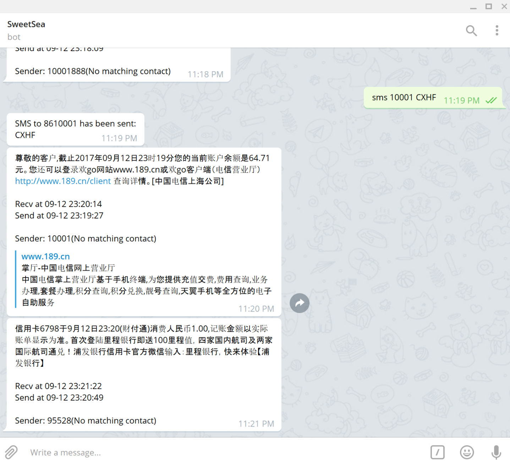
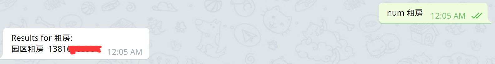

# Android SMS Relay
Script to forward android(with root) sms using adb

Useful when you have another phone number but unwilling to carry 2 phones out.

### Features

- Forward sms to telegram chat.
- Match contacts automaticly.
- Send sms using telegram.
- Some useful features: 
	- Query phone number.
	- Query curriculum.
- Dual sim card to different users.

### Prerequisite

- An android device with root and debug mode open.
    - I use an android 4.0.4 because of poor, on other versions you should check the debug and lock screen settings.
- A linux server(Rpi for example) with adb tools installed.
- Proper network connection
    - I use shadowsocks to provide a socks5 proxy for connecting to telegram server due to the GFW.
    - Also a tinc VPN is used to forward requests to inner server:
    - Flask ===SOCK FILE=== nginx(Rpi, Fudan Uni.) ===TINC=== VPS nginx(AWS, Seoul)
- Python 2.7, requests, requests[socks], flask, uwsgi, nginx

### How it works

- Pull the database every several seconds, then check new sms from it. This process only cost about 0.01 sec, so it's fine.
- Set a webhook to telegram bot, then it can receive message sent by the user.
- Simulate key press when entering PIN code after reboot.

